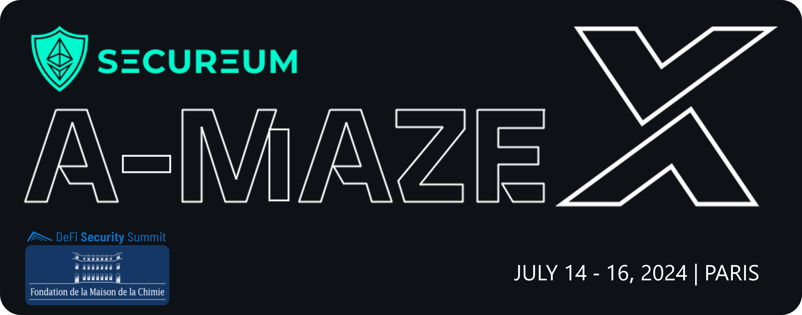

# **Secureum A-MAZE-X Maison de la Chimie, DeFi Security Summit**

## **A Smart Contract Security _Capture the Flag_ Workshop**


\*Hosted by [Defi Security Summit](https://defisecuritysummit.org) as part of **[Defi Security 101](https://defisecuritysummit.org/defi-101-2023/)\***\
_Built with love by [eugenioclrc](https://github.com/eugenioclrc), [luksgrin](https://github.com/luksgrin), [PeterisPrieditis](https://github.com/PeterisPrieditis), [RomiRand](https://github.com/RomiRand) and [misirov](https://twitter.com/p_misirov)_\
_Special thanks to [patrickd](https://github.com/patrickd-), [StErMi](https://github.com/StErMi), [tinchoabbate](https://github.com/tinchoabbate) and [Rajeev](https://twitter.com/0xrajeev) for reviewing, commenting and helping during the elaboration and design of this CTF Workshop_

---

<br>

# Contents

1. [**Instructions** 🕹️](#instructions-%EF%B8%8F)
   - [**Flavors**](#flavors)
   - [**How to play** ♘](#how-to-play-)
2. [**Challenges** 🎮](#challenges-)
3. [**CTF Writeup** 🗒️🗒️🗒️](#ctf-writeup-%EF%B8%8F%EF%B8%8F%EF%B8%8F)

# **Instructions** 🕹️

This Workshop consists in a series of challenges, of increasing difficulty, targeting different **concepts** and common **vulnerabilities** found in **DeFi**. The CTF consists of a series of challenges suitable for different levels of expertise.

---

<br>

## **Flavors**

This workshop provides different flavors.
Feel free to use the one you feel more comfortable with:

- **Option 1**: Locally with `Foundry`
- **Option 2**: Online through Gitpod, using `Foundry` [](https://gitpod.io/#https://github.com/misirov/DEFI101-CTF/tree/main)

---

<br>

## Important note

This set of challenges aren't set for competitive purposes. Their main objective is to showcase scenarios involving DeFi, `Solidity` concepts and common vulnerabilities.

Focus on **learning** and having **fun**! 😊

<br>

## **How to play** ♘

This challenge is thought for users who are very familiar with `Solidity` and do not want to use additional languages.
The following setup tutorial will guide you through the installation of `Foundry` and its setup.

<br>

### **Clone this repository**

Run the command below to clone this repository into your local machine

```bash
git clone https://github.com/secureum/AMAZEX-DSS-PARIS.git
cd AMAZEX-DSS-PARIS
```

<br>

### **Install `Foundry`** _(if you don't have `Foundry` already installed)_

Run the command below to get `foundryup` the `Foundry` toolchain installer:

```bash
curl -L https://foundry.paradigm.xyz | bash
```

Then, in a new terminal session (or after reloading your `PATH` environmental variable), run `foundryup` to get the latest `forge` and `cast` binaries:

```console
foundryup
```

And finally, install the repository's dependencies by entering it and running:

```console
forge install
```

Note that you might have to restart your terminal for the `forge` command to become available.

At this point you should be all set. If not, check [`Foundry`'s installation troubleshooting](https://github.com/foundry-rs/foundry#troubleshooting-installation).

<br>

### **Solving a challenge**

Challenge contracts are located in the subdirectories of the `src/` directory. **Do not** modify them, as it may lead to unexpected behaviors within the challenges.

To solve a challenge, you must open the corresponding `test/ChallengeX.t.sol` _(where X is a number)_ and add your exploit code in the signalized areas within said file.

Then, to check if the challenge has been solved, execute the following command

```bash
forge test --match-path test/ChallengeX.t.sol
```

If the solution criteria have been reached, it shall display the following message

```bash
Running 1 test for test/ChallengeX.t.sol:ChallengeXTest
[PASS] testChallenge() (gas: XXXX)
Test result: ok. 1 passed; 0 failed; finished in XXXms
```

Alternatively, to check if all challenges have been solved, execute the following command:

```bash
bash isSolved.sh
```

which will return the test results for all challenges in order.

If one wishes to have a more detailed prompt (i.e. to see the logged messages), it is necessary to increase the verbosity with `-vvvv`, for example:

```bash
forge test --match-path test/ChallengeX.t.sol -vvvv
```

---

# **Challenges** 🎮

- [**Challenge 1: Operation magic redemption** 🪄🔮](src/1_MagicETH/README.md)
- [**Challenge 2: Mission Modern WETH: Rescue the Ether** 🧗🧭](src/2_ModernWETH/README.md)
- [**Challenge 3: LendEx pool hack** 🤺🃏](src/3_LendingPool/README.md)
- [**Challenge 4: Operation Rescue `POSI` Token!** 💼🔓](src/4_RescuePosi/README.md)
- [**Challenge 5: Balloon Vault** 🎈🎈](src/5_balloon-vault/README.md)
- [**Challenge 6: Safe Yield?** 🏦📈](src/6_yieldPool/README.md)
- [**Challenge 7: Crystal DAO** 💎💎](src/7_crystalDAO/README.md)
- [**Challenge 8: Liquidatoooor** 🔱🔱](src/8_oiler/README.md)

---

# **Slides**

Find the slides of the event's presentation [here](./presentation/A-MAZE-X%2C%20Secureum%20at%20DeFi%20Security%20101%20Paris.pdf).

---

# **CTF Writeup** 🗒️🗒️🗒️

**_Writeups will be available after the event_**

[**SOLUTIONS**](https://www.youtube.com/watch?v=dQw4w9WgXcQ)
